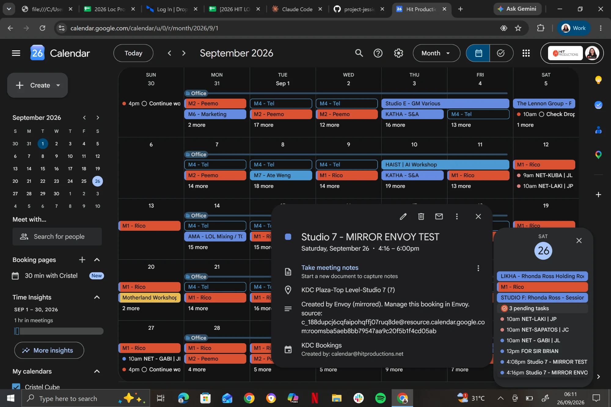

# EOD — 26 September 2026

Tel's day on **PENDING 42 (Envoy tablets)**. The **Envoy mirror is built, imported and working**. It
copied real tablet bookings onto KDC Bookings and followed a tablet edit. It is **not published yet** (one
release/delete check left).

## Envoy mirror (PENDING 42): built, imported, revised, live-checked

### v1 scaffold reviewed: not importable

`workflows/envoy-mirror-v1.json` had four problems. **Don't import it.**
- It called Google from inside a Code node (`httpRequestWithAuthentication`). A Code node has no
  credential slot and ours run in the task runner, so it would almost certainly have failed on the first run.
- A room calendar read that errored was read as "every booking cancelled": its copies were deleted, then
  recreated next run, leaving a double-book window.
- A KDC read that errored was read as "no copies yet", so every tablet booking would have been duplicated.
- Room reads stopped at 250 with no paging; the rest looked deleted.

### v2 built (`workflows/envoy-mirror-v2.json`)

Every 2 min → `Room Calendars` (Code, 27 rooms, Studio E on the live id) → `Read Room Calendar` (HTTP, per
room) + `Merge Reads` (by position) → `Read KDC Mirrors` (HTTP, once) → `Plan Changes` (Code) → `Route Op`
→ `Create / Update / Delete Copy` (HTTP). Same `Google Calendar account` credential as Find Booking.
- **Fails closed:** a room whose read errored or came back partial gets no deletes; a failed or partial
  KDC read writes nothing; more than 25 deletes in one run are held.
- Run record = the first `Plan Changes` item (`op: summary`): `unreadable`, `desired`, `creates`, `updates`,
  `deletes`…
- New `./scripts/test-mirror`, offline scenarios (16 after the revision below).

### Imported by Tel through the browser; first live runs

- Import from File into Howard's project. Merge and Switch (first use in this repo) imported cleanly.
- **Run 1:** all 27 room calendars and KDC Bookings read (`unreadable: []`), `desired: 0`. Correct:
  checked through Google Calendar, Studio 7's only tablet bookings (22–23 Sep) were outside the window. They
  also confirmed the filter: every tablet booking has an id starting `rooms`, "Created by Envoy", and the room
  as organizer.
- **Run 2:** Tel booked "MIRROR TEST" on the Studio 7 tablet. The copy appeared on KDC Bookings with the right
  title, time and location, and **no room invite**.

### Review after the first live run: three problems, fixed in the same v2 file

1. **Database fill.** n8n saved every run in full: 720 runs a day, each holding 27 calendar reads, against a
   pruner that keeps 7 days and deletes 800 a night. That's the 2–3 Sep failure mode (SQLite ~750 MB took
   Jessie and Posty off Slack). Now `saveDataSuccessExecution: none` (failed and manual runs still saved), and
   reads request only the fields used (`fields=`).
2. **Move Booking couldn't see copies.** Its `Check New Window` compares location **exactly**. Jessie's
   bookings carry Google's full resource name (`KDC Plaza-Top Level-Studio 7 (7)`; Book Session sets no
   location), and v2 wrote `Studio 7`. Book Session and Room Availability were fine (substring match). Copies
   now take the tablet booking's own location, which is that full name.
3. **Silent failures.** Writes continued on error and showed green. Now writes stop on error (one retry), and
   `Plan Changes` throws if no room could be read (expired credential) or reads don't pair with rooms.

Checked and fine: preemption can't bump a copy (no `SType:`, so rank unknown); Find Booking attributes the
copy to its room.

### Revised file re-imported (16:35): working

- `desired: 2`, `updates: 2`: both test copies now carry `KDC Plaza-Top Level-Studio 7 (7)` (read back
  through Google Calendar).
- A tablet edit was followed: MIRROR TEST shortened to end 16:15, and its copy followed.
- **Jessie's side:** her **live code** (25 Sep `workflows/live/` snapshot), run offline against the copy
  exactly as Google returned it:
  - Room Availability: `BUSY`, taken by "Studio 7 - MIRROR ENVOY TEST".
  - Move Booking `Check New Window`: `REJECTED ROOM_OCCUPIED`. The same move against the old bare-`Studio 7`
    copy came back `CLEAR`: that was the bug, now closed.

### Example: one tablet booking through the mirror (today's real test)

```
Studio 7 door tablet ──► Studio 7 room calendar ──► Envoy Mirror (every 2 min) ──► KDC Bookings ──► Jessie
   "MIRROR ENVOY TEST"        (resource calendar)     reads 27 rooms, copies            the copy      sees the room
   booked 16:16–18:00                                  Envoy bookings                                 as busy
```

**1. What the tablet writes**, on the Studio 7 room calendar only (Jessie never reads this calendar):

| field | value |
|---|---|
| title | `MIRROR ENVOY TEST` |
| time | 26 Sep, 16:16–18:00 |
| location | `KDC Plaza-Top Level-Studio 7 (7)` |
| description | `Created by Envoy` |
| organizer | the Studio 7 room itself; event id starts `rooms…` (how the mirror recognizes a tablet booking) |

**2. What the mirror writes**, on KDC Bookings (where every Jessie guard looks):

| field | value |
|---|---|
| title | `Studio 7 - MIRROR ENVOY TEST` |
| time | 26 Sep, 16:16–18:00 (kept in step with the tablet) |
| location | `KDC Plaza-Top Level-Studio 7 (7)` (same string as Jessie's own bookings) |
| description | `Created by Envoy (mirrored). Manage this booking in Envoy.` + `source: <room calendar>:<tablet event id>` |
| guests | **none**, so the room isn't invited twice and the tablet shows no duplicate |
| hidden marker | `envoyMirrorSource`, used to update or delete this copy when the tablet booking changes |

How it looks on the KDC Bookings calendar in Google Calendar (both test copies at 4:08 and 4:16 pm on
Saturday 26; the open card is MIRROR ENVOY TEST, showing the room location and the "Created by Envoy
(mirrored)" description, created by `calendar@hitproductions.net`):



**3. The run record** (first item out of `Plan Changes`), for the run right after the re-import:

```
op: summary   rooms: 27   paired: true   unreadable: []   incomplete: []
desired: 2    existing: 2   creates: 0   updates: 2   deletes: 0
```

`desired: 2` = two tablet bookings in the window (MIRROR TEST and MIRROR ENVOY TEST); `updates: 2` = both
copies rewritten to the full room-name location.

**4. What Jessie then does with it** (her live code, run against this copy):
- "Is Studio 7 free 17:00–18:00?" → `BUSY`, taken by "Studio 7 - MIRROR ENVOY TEST".
- Moving a booking into Studio 7 at 17:00 → refused, `ROOM_OCCUPIED`.
- Booking Studio 7 at 17:00 → refused, `ROOM_OCCUPIED` (same location match as availability).
- Cancelling or moving the copy itself → refused, no `ref:`. It's managed on the tablet.

**5. When the tablet booking changes:**
- Edited or released early (end time moves) → next run: `updates: 1`, the copy's time follows.
- Cancelled before it starts (event deleted) → next run: `deletes: 1`, the copy is removed.

### Two findings about testing and the tablets

- **Jessie can't be asked about a tablet booking until launch.** With the QA year shift "today" is 2027 to
  her: "is Studio 7 free today?" checked 2027 and said free, and "26 September 2026" was refused as past.
  Not a mirror problem; it clears when `YEAR_SHIFT` goes to zero.
- **A tablet "release" ends the booking early; it doesn't delete it.** The end time moves to the release
  time and the event stays. The mirror handles that as an **update** (the copy is shortened, freeing the rest
  of the slot). A **delete** only happens when a booking is cancelled before it starts.

## Studio E dead id (PENDING 43): fix script ready, not applied

`./scripts/fix-studio-e <files>` swaps `c_18807te03d2sqh0lmtal9sbb04gao` (not found) for
`c_1888r4bbc2lhqgndmprism70nft64` in a freshly pulled file, nodes only (never `activeVersion`, gotcha 8);
`--check` reports leftovers. Dry run on copies of the 25 Sep backups found **6 places in 5 workflows**:
- **Book Session:** `Create Event`, the room invite, and `Check Conflicts`. The design doc listed only the first.
- **Room Availability:** `Compute Availability`.
- **Move Booking:** `Resolve Booking`. The draft only said "check it".
- **Find Booking:** `Shape Results`.
- **main:** `Create Event`, a **disabled tool node wired to nothing**, so fix it on main's next import rather
  than importing main for this alone.

The id was the only change in each file. `test-nodes`: 209 checks + 28 gate scenarios pass before and after;
`check-fromai` clean. Apply commands are in `docs/design/studio-e-id-fix.md`.

## Live after today

**This work changed no Jessie workflow.** Separately, others shipped today (merged from `main`; see
`git log` and PENDING 45–48): **main v159** (date guard; v156 message_changed fix, v157 trimmed prompt; v158
rolled back) and **Book Session v47** (`DATE_MISMATCH`). Room Availability v8, Cancel v15, Move v19, Open
Consent Request v10, Finalize v9, Sweep v1 unchanged. The dead Studio E id is still in Book Session v47 and
main v159; `fix-studio-e` covers them (apply to fresh pulls). **New, not published:** `Jessie — Envoy Mirror` (revised
v2), in Howard's project. On KDC Bookings: two test copies, "Studio 7 - MIRROR TEST" and "Studio 7 - MIRROR
ENVOY TEST" (today, past once they end; delete by hand if unwanted).

## Follow-ups

1. **PENDING 42, finish the mirror:**
   - Execute after the MIRROR ENVOY TEST release and expect `updates: 1` (end time shortened). At last check
     the release hadn't reached Google yet.
   - Optional delete check: book a future slot on a tablet, execute (`creates: 1`), cancel it, execute
     (`deletes: 1`).
   - **Publish.**
   - Pull it into the repo, and add its id to `verify-ids` and the CLAUDE.md workflow table.
2. **PENDING 43:** apply the Studio E fix (pull, `fix-studio-e`, `test-nodes`, put, Active
   toggle on Book Session, `health`).
3. **Mirror format (proposed, waiting on Tel):** make copies read like Jessie's.
   - Title `<tablet title> (tablet)`.
   - Description `Booked by: <tablet booker> (tablet) | Source: Envoy tablet`, with the booker read off the
     tablet booking, so Find Booking answers "who has Studio 7?".
   - Still **no `ref:`/`SType:`**, on purpose.
4. **Edge case, not fixed:** Move Booking's exact-location check won't see a copy when the booking being
   moved is a two-room booth pairing. The fix belongs in Move Booking.
5. **PENDING 44** matters more now that tablets book rooms (reply "Booked" before the room declines).

## Decision

**The mirror, not the read-side change**, for PENDING 42: one new workflow instead of edits to three hot-path
ones. Accepted cost: up to a 2-minute window where a new tablet booking is invisible to Jessie.
